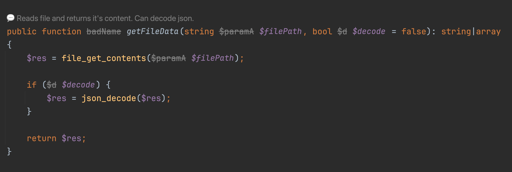

# Hidden Refactoring (PhpStorm Plugin)

**Hidden Refactoring** lets you leave notes and rename methods/variables **with zero changes to the repo**.



## Features
- __Comments on PHP code__ (Code Vision hints) for classes, methods, functions, and files — quick popup to view/edit/delete.
- __On‑the‑fly aliases__ for variables, parameters, methods, and functions across the project — without touching the source.

## Requirements
- PhpStorm 2024.3+ (build 243.*)
- PHP plugin enabled: `com.jetbrains.php`
- JDK 17+ for building

## Installation
Recommended: download the prebuilt ZIP from GitHub Releases and install from disk.

1) Download: https://github.com/underwear/hidden-refactoring/releases
2) PhpStorm → Settings → Plugins → Gear → Install Plugin from Disk…
3) Choose the downloaded ZIP and restart PhpStorm.

Alternatively, build from source:

```bash
./gradlew buildPlugin
```
Then install the ZIP from `build/distributions/` as above.

## Usage
- Place caret on a class/method/function (or in a file for a file-level note) and run: "Hidden Refactoring: Add Comment".
- Aliases: click an inline alias to edit, or use the action "Hidden Refactoring: Rename Alias" on the symbol.
- Comments show as `💬` hints; click to view/edit/delete.

## Development
- Update version in `gradle.properties` → `pluginVersion`
- Build: `./gradlew buildPlugin`
- Run sandbox: `./gradlew runIde`
- Tag releases as `v<version>` and push tags

## Issues & ideas
- Bugs, ideas, requests — please open an Issue.
- Have a wild feature idea for the my next vibe-coding session? Drop it in Issues; best ones get built first.
